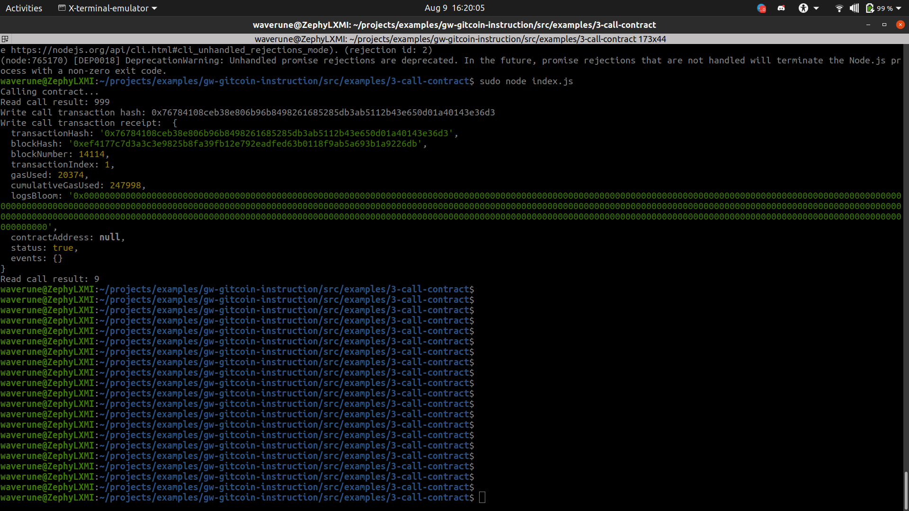

<!-- @format -->

#console ss

#Transaction hash
'0x76784108ceb38e806b96b8498261685285db3ab5112b43e650d01a40143e36d3'

#Contract address
'0xffDa67607657A01C0404C83407dF08bdD0Ea561c'

#abi
[
{
"inputs": [],
"stateMutability": "payable",
"type": "constructor"
},
{
"inputs": [
{
"internalType": "uint256",
"name": "x",
"type": "uint256"
}
],
"name": "set",
"outputs": [],
"stateMutability": "payable",
"type": "function"
},
{
"inputs": [],
"name": "get",
"outputs": [
{
"internalType": "uint256",
"name": "",
"type": "uint256"
}
],
"stateMutability": "view",
"type": "function"
}
]
