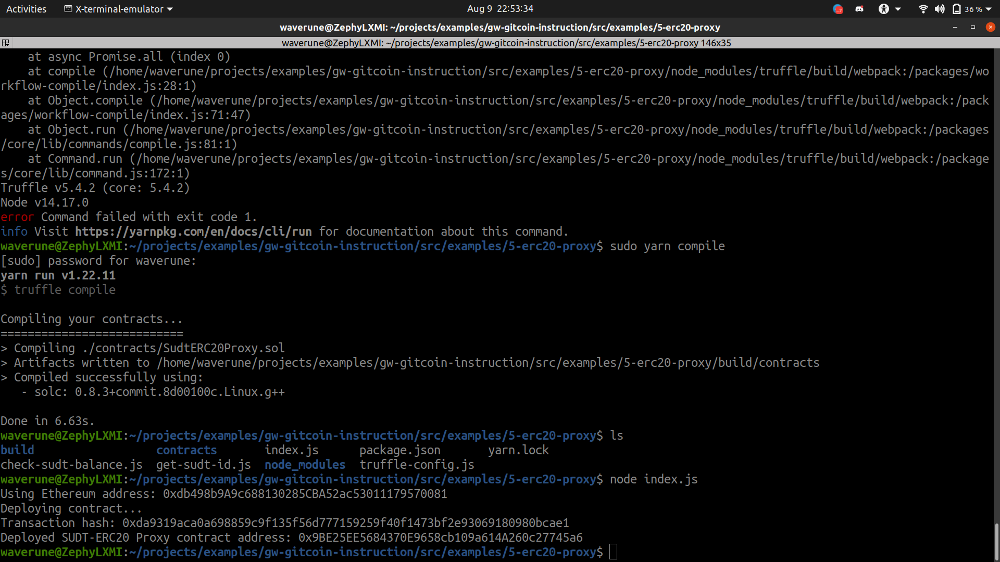
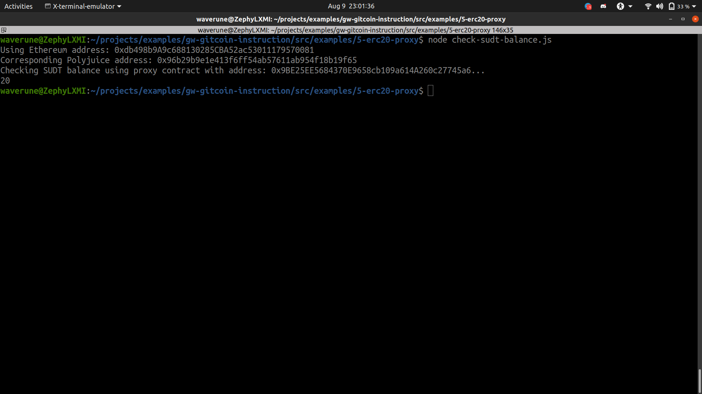

<!-- @format -->

# deployed contract (ss)

# Proxy contract address

0x9BE25EE5684370E9658cb109a614A260c27745a6

# sudt balance checked (ss)

# eth address checked

0xdb498b9A9c688130285CBA52ac53011179570081
