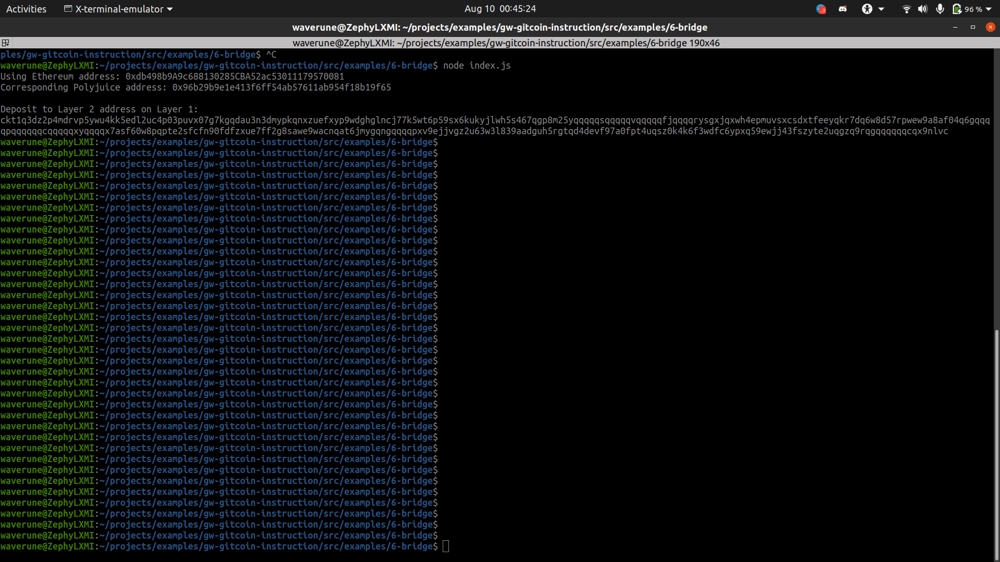

<!-- @format -->

# Deposit receiver address console output(ss)

# deposit receiver address

ckt1q3dz2p4mdrvp5ywu4kk5edl2uc4p03puvx07g7kgqdau3n3dmypkqnxzuefxyp9wdghglncj77k5wt6p59sx6kukyjlwh5s467qgp8m25yqqqqqsqqqqqvqqqqqfjqqqqrysgxjqxwh4epmuvsxcsdxtfeeyqkr7dq6w8d57rpwew9a8af04q6gqqqqpqqqqqqcqqqqqxyqqqqx7asf60w8pqpte2sfcfn90fdfzxue7ff2g8sawe9wacnqat6jmygqngqqqqpxv9ejjvgz2u63w3l839aadguh5rgtqd4devf97a0fpt4uqsz0k4k6f3wdfc6ypxq59ewjj43fszyte2uqgzq9rqgqqqqqqcqx9nlvc

# eth address

0xdb498b9A9c688130285CBA52ac53011179570081

# etherscanExplorer link

https://rinkeby.etherscan.io/tx/0x86a70018e40bc3b0df8f8218609af5b15508315e3ef95b160effd672c7c6213a

# Nervos explorer link

https://explorer.nervos.org/aggron/transaction/0x727643c11415219fbf854ac833155bd77ed7ed34247aff533e9c3a07cdfd8f7d
