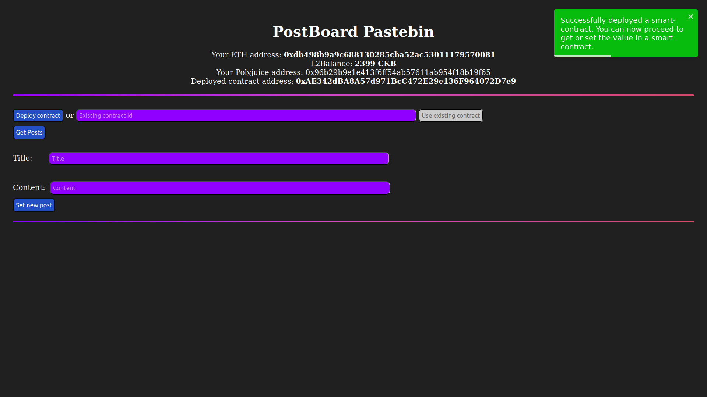

<!-- @format -->

# PostBoard Pastebin Application on Godwoken Network

# Repository Link

https://github.com/waverune/nervos-submissions/tree/main/task7/postboard

# Deployed Smart Contract

## Transaction Hash

0xa582be6dfd7abdbb9bcd50ddc04be3d47adc83000d6b5134feceede426479519

## Deployed Contract Address

0xAE342dBA8A57d971BcC472E29e136F964072D7e9

## Contract ABI

"abi": [
{
"inputs": [
{
"internalType": "string",
"name": "_greet",
"type": "string"
}
],
"stateMutability": "nonpayable",
"type": "constructor"
},
{
"inputs": [
{
"internalType": "uint256",
"name": "",
"type": "uint256"
}
],
"name": "posts",
"outputs": [
{
"internalType": "uint256",
"name": "uuid",
"type": "uint256"
},
{
"internalType": "string",
"name": "content",
"type": "string"
},
{
"internalType": "string",
"name": "title",
"type": "string"
}
],
"stateMutability": "view",
"type": "function"
},
{
"inputs": [
{
"internalType": "uint256",
"name": "",
"type": "uint256"
}
],
"name": "postsEndTime",
"outputs": [
{
"internalType": "uint256",
"name": "",
"type": "uint256"
}
],
"stateMutability": "view",
"type": "function"
},
{
"inputs": [
{
"internalType": "uint256",
"name": "_endTime",
"type": "uint256"
},
{
"internalType": "string",
"name": "_content",
"type": "string"
},
{
"internalType": "string",
"name": "_title",
"type": "string"
}
],
"name": "createPost",
"outputs": [],
"stateMutability": "nonpayable",
"type": "function"
},
{
"inputs": [],
"name": "getEndTimeArray",
"outputs": [
{
"internalType": "uint256[]",
"name": "",
"type": "uint256[]"
}
],
"stateMutability": "view",
"type": "function"
},
{
"inputs": [],
"name": "readPostCount",
"outputs": [
{
"internalType": "uint256",
"name": "",
"type": "uint256"
}
],
"stateMutability": "view",
"type": "function"
},
{
"inputs": [
{
"internalType": "string",
"name": "_greet",
"type": "string"
}
],
"name": "setGreet",
"outputs": [],
"stateMutability": "nonpayable",
"type": "function"
},
{
"inputs": [],
"name": "getGreet",
"outputs": [
{
"internalType": "string",
"name": "",
"type": "string"
}
],
"stateMutability": "view",
"type": "function"
}
]
