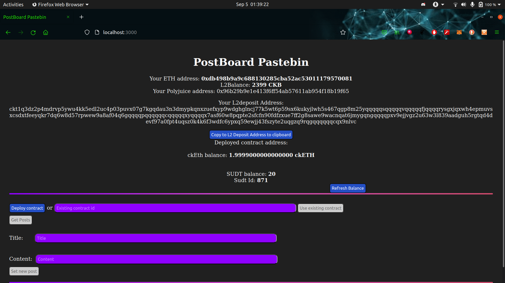
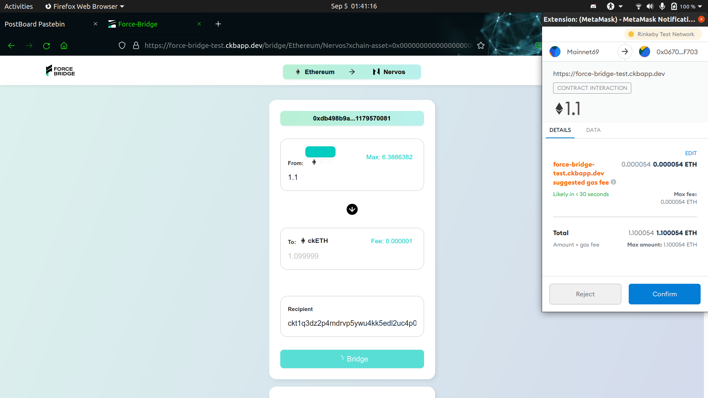
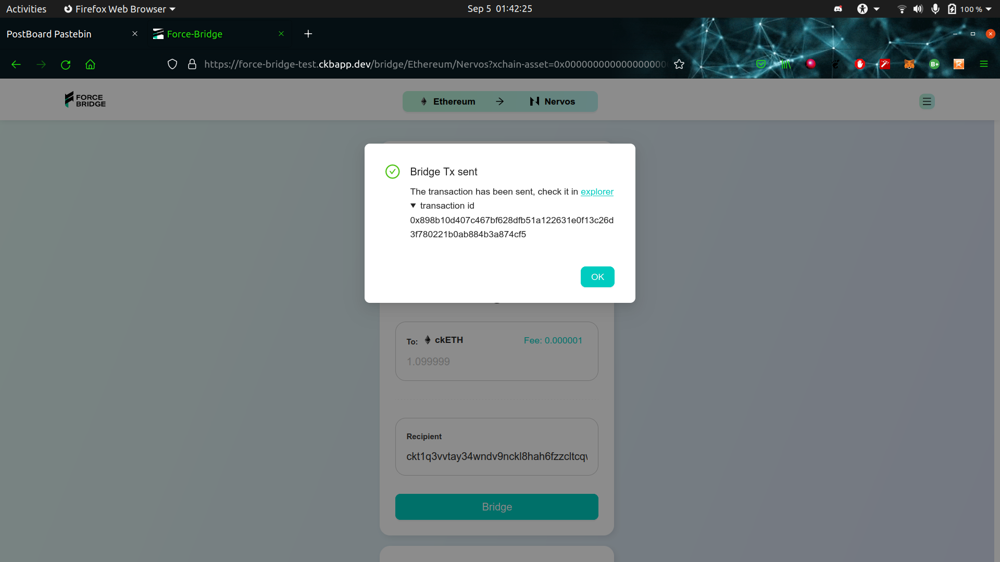

<!-- @format -->

# Force Bridge Dapp

# Project Source Code

[source](https://github.com/waverune/nervos-submissions/tree/main/task7/postboard)

# The address of the SUDT-ERC20 Proxy Contract

"0x2e18465EA319F6FbADE7395C808E19DAb158Ef35"

SUDT_id : 871

// node ./packages/tools/lib/account-cli.js withdraw -r http://3.235.223.161:18114 -p ***REMOVED*** -o ckt1qyqqejz2tdf0q96rwcpajsx3lx9re7xp07fqg8yeud -c 300000000
